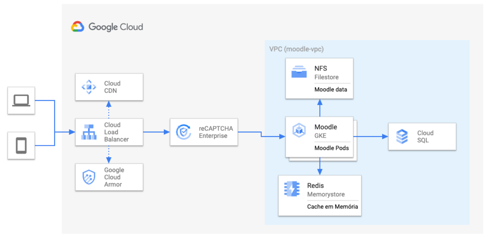

# Architecture

Moodle is comprised of three main components: 
1. **Web application**: The PHP-based web component that runs Moodle Core and its extensible plugins. It has both frontend and backend operations in a single monolith.
   
2. **Relational database**: Hosts Moodle's relational data. Users (students, teachers, etc), Grades, Courses, Questions, Enrollment, are some of the entities hosted by Moodle's database. Currently, Moodle does support multiple databse providers: [MySQL](https://www.mysql.com/), [MariaDB](https://mariadb.com/), [Postgress](https://www.postgresql.org/), [MS SQL Server](https://www.microsoft.com/en-us/sql-server/sql-server-2019) and [Oracle](https://www.oracle.com/database/).
   
3. **File store**: A file store system for storing whatever file format generated by Moodle's users/institutions like pictures, videos, pdfs, and so on.

Those three components can be either be hosted in one single machine (usual approach for small environments) or spread it across multiple machines with load balancers in front of it (usually the case for larger environments) with the most common implementation being on top of on-premise datacenters. 

The complexity of keeping Moodle "inside the house" has always been how to scale storage, performance and resilience while respecting budgetary constraints related to IT investments. This is where running Moodle in GCP comes into play.

## Modern Moodle's architecture in GCP

In order to bring Moodle to the exciting world of "cloud native", we have redesigned its infrastructure and hosting model respectivelly, putting it to run on top of GCP's cutting edge technology, as you can see below.

    

The components for this architecture are:

* **[Cloud Load Balancer](https://cloud.google.com/load-balancing)**: It does play the role of ingress for the Kubernetes cluster and manages incoming traffic to Moodle's intances in the backend.

* **[Cloud CDN](https://cloud.google.com/cdn)**: It does cache out static content (HTML, CSS, Javascript, images, videos, PDFs, etc) so that users can consume those heavy and immutable files from the closest GCP's CDN pop, which decreases considerable response time for each request.

* **[Cloud Armor](https://cloud.google.com/armor)**: Web Application Firewall (WAF) which enables protection againts different sorts of attacks, like: DDoS, OWASP, and more.

* **[reCAPTCHA Enterprise](https://cloud.google.com/recaptcha-enterprise)**: Optional. Add an extra layer of security, making sure only humans have access to certain operations with the web application.

* **[Google Kubernetes Engine (GKE)](https://cloud.google.com/kubernetes-engine)**: Runs Moodle core components (frontend and backend) as specialized Pods in a Google's managed and high-scalable built-in Kubernetes cluster. It does add, among other things, reliability, scalability whilwe keeping flexibility.

* **[Google Cloud SQL](https://cloud.google.com/sql)**: Serves Moodle's pods with high-scalable MySQL. Can be widely configured for high-availability, automated backups and more. Cloud SQL could also serve Moodle with Postgres and MS SQL for scenarios where it applies.

* **[Google Cloud Filestore](https://cloud.google.com/filestore)**: Filestore hosts Moodle's files while it is shared across those multiple web instances (pods). It scales itself to support increasing incoming growth for reading and writing. We recommend standing up the tier Basic_SSD for better performance.

* **[Google Cloud Memorystore](https://cloud.google.com/memorystore)**: Memorystore for Redis enables persisting user data out of the pod, supporting horizontal scale, making Moodle behave like it was designed to be stateless.