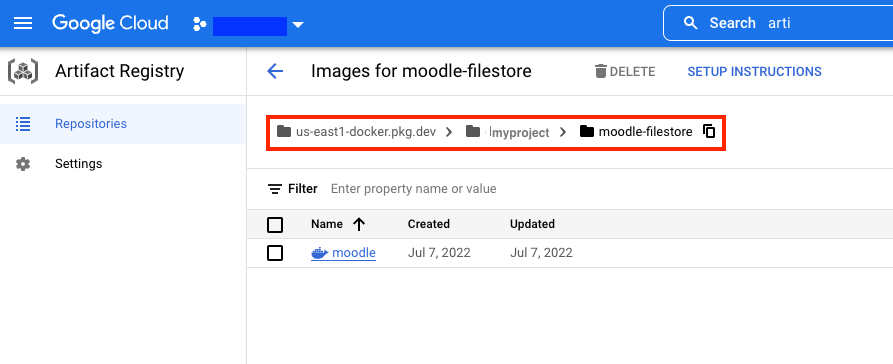
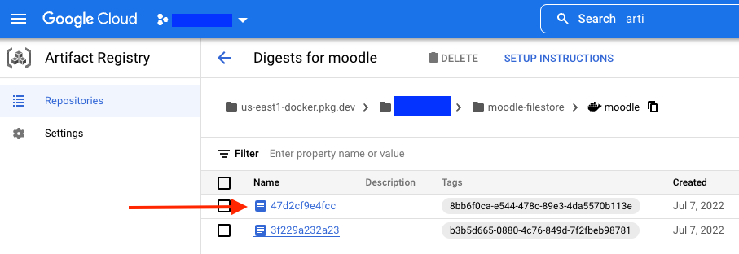

# Building Moodle's container image

This step will set up a cloud build in Google Cloud to generate a new container image for Moodle. For that, we need to edit the information available in the file `cloudbuild.yaml`, which seats on directory `4-moodle-image-builder`.

1. Let's build the image first. For that, under the `steps` below, update the second line `args` described below with information on your container registry. Replace only the piece `<YOUR-ARTIFACT-REGISTRY-AND-REPOSITORY-NAME>`.

```
args: ['build', '-t', '<YOUR-ARTIFACT-REGISTRY-AND-REPOSITORY-NAME>/moodle:$BUILD_ID', '.']
```

If you're using Google Cloud Artifactory Registry (like the example below), that information should be available to you in the context of the service's blade, as depicted by the Figure below.

<p align="center">
    
</p>

If you're using whatever other container image repository, please collect that connection information properly and make sure it can communicate back with the Kubernetes cluster.

For Artifactory Registry, the final version of that line should look like the one described below.

```
args: ['build', '-t', 'us-east1-docker.pkg.dev/myproject/moodle-filestore/moodle:$BUILD_ID', '.']
```

2. Now, let's push the image to its repository in Artifactory Registry. For that, simply repeat the process described in step 1 for the second `args` line, described below.

```
args: ['push', '<YOUR-ARTIFACT-REGISTRY-AND-REPOSITORY-NAME>/moodle:$BUILD_ID']
```
The final version of that line should look like the one described below.

```
args: ['push', 'us-east1-docker.pkg.dev/myproject/moodle-filestore/moodle:$BUILD_ID']
```

3. The final version of the file `cloudbuild.yaml` should be like the one displayed below.

```
steps:
- name: 'gcr.io/cloud-builders/docker'
  args: ['build', '-t', 'us-east1-docker.pkg.dev/myproject/moodle-filestore/moodle:$BUILD_ID', '.']
- name: 'gcr.io/cloud-builders/docker'
  args: ['push', 'us-east1-docker.pkg.dev/myproject/moodle-filestore/moodle:$BUILD_ID']
```

> From now on, this document assumes that the working machine from where you pushing commands from has access to Google Kubernetes Engine (GKE) control plane.

4. Finally, kick off the `build` and `push` process by coming back to the file `infra-creation.sh` within the directory `0-infra` and executing the following command line, placed at the end of the file.

```
cd ../4-moodle-image-builder && gcloud builds submit --region $REGION
```

Wait until you get confirmation from the command line the process finished successfully. Additionally, you can head to your image repository and double-check that the image is properly sitting there.

<p align="center">
    
</p>