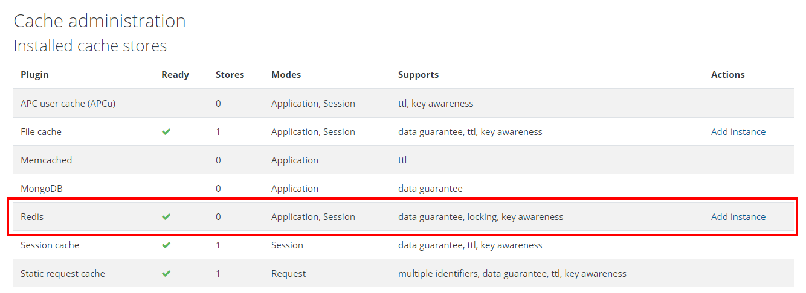
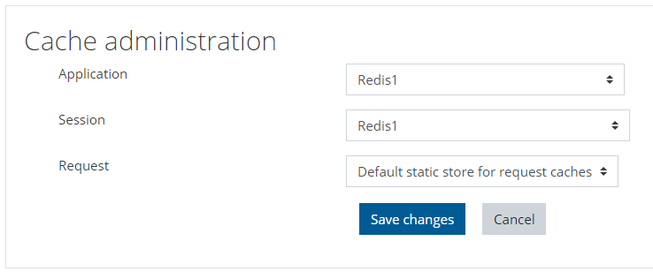

# Configuring Redis Cache with Moodle

This document will guide you through the process of getting Moodle to rely on Memorystore for Redis Cache for data persistence in memory. Having this configuration in place is highly recommended as it can increase performance consistently.

> This process must be performed after Moodle's instalation process gets finalized and the application is already up and running.

## 1. Add new entries to Moodle's config.php file

Modern Moodle on Google Cloud relies on Filestore, a GCP's managed NFS file storage service. That means that both `moodle` and `moodledata` directories are deployed in there for pod consumption and as we know, Moodle's `config.php` file does sit in `moodle` directory so, we need to find a way to get there.

The easiest way is to mount Filestore drive in the working virtual machine (that needs to be connected to the same VPC as Filestore). [This tutorial](https://cloud.google.com/filestore/docs/mounting-fileshares) describes the process of mounting the volume with all types of operational systems.

Once mounted, browse the the location where the file sits through the shared volume (for instance, `cd /mnt/mymoodleshare/moodle/`). Once in there, edit the file `config.php` and add (updating placeholders with the values of your environment) the following entries.

```
$CFG->localcachedir = '/tmp/moodle';
$CFG->session_handler_class = '\core\session\redis';
$CFG->session_redis_host = '<IP-REDIS-SERVICE>';
$CFG->session_redis_port = 6379;
$CFG->session_redis_database = 0;
$CFG->session_redis_auth = '<AUTH-STRING-REDIS-SERVICE>';
$CFG->session_redis_prefix = 'moodle_';
$CFG->session_redis_acquire_lock_timeout = 120;
$CFG->session_redis_acquire_lock_r;
```

Save the file and close it.

Next, to refresh `config.php`'s new configuration with the pods, run the following command against the file `moodle-helm-update.sh` which sits on directory `5-helm`.

```
./moodle-helm-update.sh
```

Make sure your pods are all back up and in a "running" state after a while by running the command below.

```
kubectl get pods -n moodle -w
```

## 2. Create a mapping for Redis from Moodle UI

1. Get back to Moodle's UI on your browser and log in with administrative credentials.

2. Navigate to "Site admin" > "Plugins" > "Caching" > "Configuration".

3. When installed, you should see a tick next to "Redis" under "Installed cache stores" and a link to add an instance, as depicted in the image below.

<p align="center">
    
</p>

4. Click "Add instance".

   1. Give your Redis instance a name, like "Redis1" and set the IP:port for the Redis server (you can gather that information in GCP's web console at Memorystore's service blade).

   2. The new instance should appear under "Configured store instances" with a "Ready" tick.

5. Under "Stores used when no mapping is present" click Edit mappings". Set "Redis1" (or the name used earlier) for the "Application" and "Session" caches.

<p align="center">
    
</p>

6. After saving this, you should see Redis as the cache for most cache stores.
