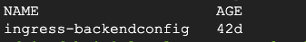

# Deploying backend configuration

> This document assumes that the working machine from where you pushing commands from has access to Google Kubernetes Engine (GKE) control plane.

1. Connect to the GKE cluster via the command line and update local cluster credentials.

```
gcloud container clusters get-credentials <GKE-NAME> \
    --region <GKE-REGION> \
    --project <PROJECT ID>
```

2. Create the backend configuration in GKE by executing the command line below. It assumes you're running it from a directory level above.

```
kubectl apply -f 6-backendconfig/ingress-backendconfig.yaml
```

3. Make sure the backend configuration was successfully created.

```
kubectl get backendconfig -n moodle
```

<p align="left">
    
</p>