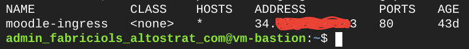

# Deploying Ingress - Cloud Load Balancer

> This document assumes that the working machine from where you pushing commands from has access to Google Kubernetes Engine (GKE) control plane.

1. Connect to the GKE cluster via the command line and update local cluster credentials.

```
gcloud container clusters get-credentials <GKE-NAME> \
    --region <GKE-REGION> \
    --project <PROJECT ID>
```

2. Provision the ingress over Cloud Load Balancer by executing the command line below.

```
kubectl apply -f 8-ingress/gce-ingress-external.yaml
```

3. Make sure the ingress configuration was successfully applied.

```
kubectl get ingress -n moodle
```

<p align="left">
    
</p>