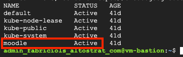

# Deploying Moodle's namespace

> This document assumes that the working machine from where you pushing commands from has access to Google Kubernetes Engine (GKE) control plane.

1. Connect to GKE cluster via command line and update local cluster credentials.

```
gcloud container clusters get-credentials <GKE-NAME> \
    --region <GKE-REGION> \
    --project <PROJECT ID>
```

2. Create the Namespace by applying the configuration to the cluster. The command below assumes you're running it from a directory a level above.

```
kubectl apply -f 2-namespace/namespace-moodle.yaml
```

3. Make sure the Namespace was successfully created.

```
kubectl get ns
```

<p align="left">
    
</p>