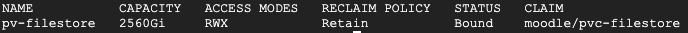

# Deploying Persistent Volume (PV)

> This document assumes that the working machine from where you pushing commands from has access to Google Kubernetes Engine (GKE) control plane.

1. Connect to GKE cluster via command line and update local cluster credentials.

```
gcloud container clusters get-credentials <GKE-NAME> \
    --region <GKE-REGION> \
    --project <PROJECT ID>
```

2. Update "server" property under "nfs" object with Filestore's internal IP (you can obtain it either from web console or `gcloud`).

```
nfs:
    path: /moodleshare
    server: <YOUR-FILESTORE-INTERNAL-IP> # filestore's internal IP
```

3. Create the Persistent Volume (PV) by applying the configuration to the cluster. The command below assumes you're running it from a directory a level above.

```
kubectl apply -f 1-pv/pv-filestore.yaml
```

4. Make sure the Persistent Volume was successfully created.

```
kubectl get pv
```

<p align="left">
    
</p>