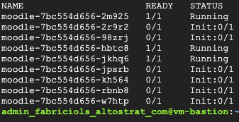

# Deploying Moodle in GKE with Helm

> This document assumes that the working machine from where you pushing commands from has access to Google Kubernetes Engine (GKE) control plane.

This document will guide you through the steps to get Moodle's pods deployed in Google Kubernetes Engine (GKE). 

Although there are hundreds of variables that allow all sorts of customizations to the environment, this document focuses only on the required ones. Please, feel free to do further customizations if you're secure about the changes. 

## Update variables in `moodle-values.yaml`

The very first step is to replace values of key variables in the `moodle-values.yaml`. This file is read in execution time by Helm to install Moodle with all its properties. To do that, please, follow the sub-steps below.

1. Browse into directory `5-helm`.
   
2. Edit the file `moodle-values.yaml` with your preferred text editor.

3. Update values for the following variables (they refer to the Artifactory Registry).

```
image:
  registry: <YOUR-ARTIFACT-REGISTRY>
  repository: <YOUR-REPOSITORY>
  tag: <YOUR-IMAGE-TAG>
```
A real example of this replacement could be:

```
image:
  registry: us-east1-docker.pkg.dev
  repository: myproject/moodle-filestore/moodle
  tag: 48454sde1-e544-478c-89e3-4da1230b008f
```

4. Define Moodle's admin username.

```
moodleUsername: "<YOUR-MOODLE-ADMIN-USERNAME>"
```
A real example of this replacement could be:

```
moodleUsername: "moodleadmin"
```

5. Define a password for Moodle's admin.

```
moodlePassword: "<YOUR-MOODLE-ADMIN-PASSWORD>"
```

A real example (please, don't use it) of this replacement could be:

```
moodlePassword: "123@P@ssw0rd"
```

6. Set proper values for PHP key variables, as listed below.

```
extraEnvVars:
  - name: PHP_ENABLE_OPCACHE
    value: "true"
  - name: MOODLE_DATABASE_TYPE
    value: "mysqli"
  - name: PHP_MEMORY_LIMIT
    value: "768M"
  - name: PHP_MAX_EXECUTION_TIME
    value: "1200"
  - name: PHP_MAX_INPUT_VARS
    value: "6000"
```

7. Configure resource request limits, as listed below.

```
resources:
  requests:
    memory: 512Mi
    cpu: 300m
  limits:
    memory: 1Gi
    cpu: 1000m
```

8. Set up database information for the application.

```
externalDatabase:
  host: "<YOUR-INTERNAL-MYSQL-HOST-IP-ADDRESS>"
  port: 3306
  user: root
  password: "<YOUR-DATABASE-PASSWORD>"
  database: <YOUR-MOODLE-DB-NAME>
```

A real example of this replacement could be (password merely illustrative. Please, don't use it in production):

```
externalDatabase:
  host: "10.11.2.5"
  port: 3306
  user: root
  password: "123@P@ssw0rd"
  database: moodle-db
```

## Install Moodle in GKE

> From now on we assume you know what Helm is and that you have it already installed in your working machine. If you're not sure about what Helm is and how to get it installed, please, refer to the [pre-requisits](pre-requisites.md) document in this repo.

To install Moodle in GKE with Helm, from a command line with access to the GKE control plane run the following command.

```
./moodle-helm-install.sh
```

> Please notice: it can take a while for Moodle to stand up as it needs to install all the files and set up the database properly. 

In the end, you should be able to see your pods properly running, as depicted below, by running `kubectl get pod -n moodle`. Notice that during the process, pods can get in the `Init` state for while, until they get to the `Running` state.

<p align="left">
    
</p>
