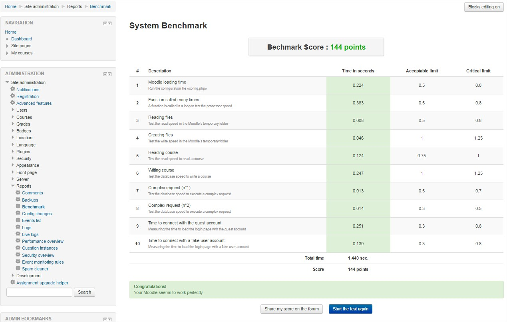

# Running a benchmark to check the performance

Once your Moodle instance is up and running, there are a set of recommended steps you can take to refine it for a better user experience. The very first one would be running a general performance test to get a sense of the environment's performance.

A good first step towards that is running one of the most utilized and praised plugins ever developed by Moodle community for that purpose: [Moodle Benchmark](https://moodle.org/plugins/report_benchmark).

It does verify, at a high level, the following aspects of the installation.

* Server speed
* Processor speed
* Harddrive speed
* Database speed
* Loading page speed

    

Moving forward, we'll describe the steps needed to install and execute the plugin from your Moodle administrative panel.

## 1. Installing the plugin

The easiest way for installing Moodle Benchmark is through adding it directly from the "Moodle Plugins directory", in the administrative panel, as described below.

* Log in as an admin and go to Site administration > Plugins > Install plugins.

* Click the button "Install plugins from Moodle plugins directory".

* Search for "Moodle benchmark" and once you find it, click the Install button then click Continue.

* Confirm the installation request

* Check the plugin validation report

That's it. 

## 2. Running Moodle Benchmark

After the plugin is installed, proceed as follows to get your environment tested. 

* Go to "Site administration" > "Reports" > "Benchmark" > "Start the benchmark" to perform the benchmark. 
  
* The benchmark tests should last less than 1 minute and will be aborted at 2 minutes regardless, revealing whether there are worries on your platform. The lower the score, the better, and if all is green, it generally indicates that our Moodle site should be in good shape.