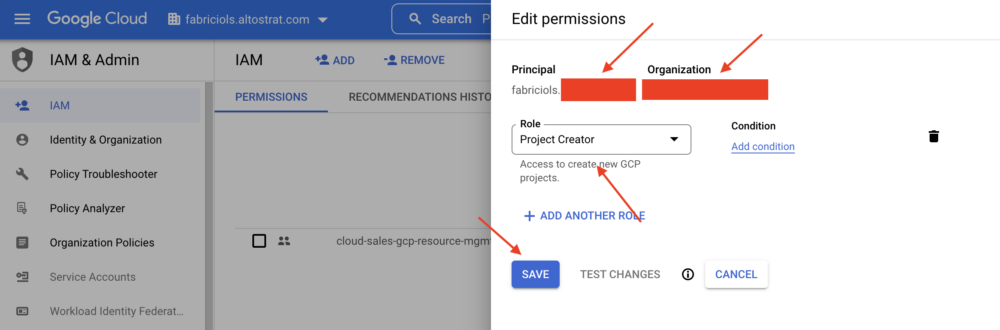
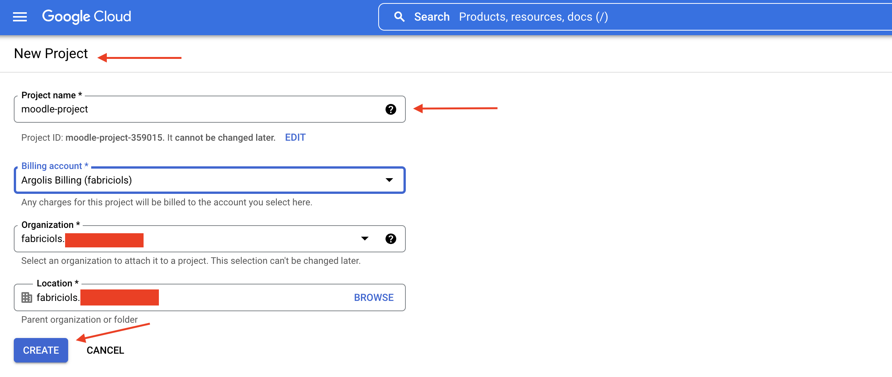
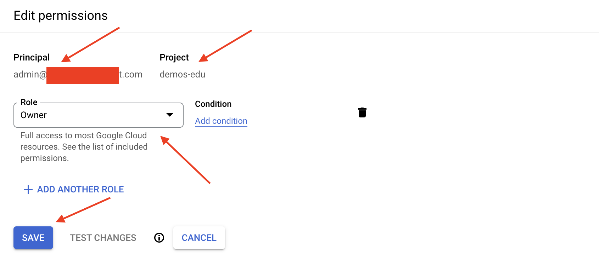
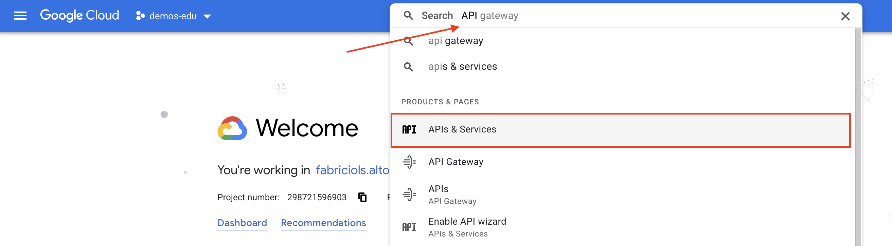
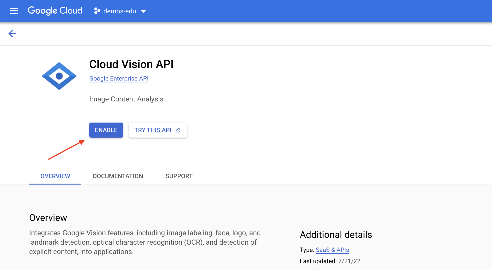
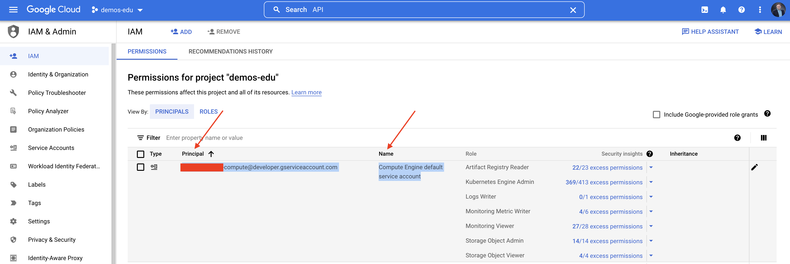

# Pre-requisites

Deploying Modern Moodle in Google Cloud will require certain aspects to be in place before getting the hands down with allocating resources in the cloud.

This document outlines all the main aspects that need to be taken care of before deploying Modern Moodle on Google Cloud.

## Google Cloud account

Modern Moodle runs on top of Google Cloud Platform's services like Kubernetes Engine, Cloud SQL, Filestore among others. Because of that, customers leveraging it are going to need to have a Google Cloud account in place.

If you company already has a account with Google Cloud, please talk to your administrator to get you properly settled with permissions to deploy it.

If you're new to Google Cloud and would like to spin up Modern Moodle as your first workload in the cloud or learning how to operate Google Cloud, please refer to [this link](https://cloud.google.com/free) to get a free account.

## Get a project set up and administrative rights for it

One of the tools available in Google Cloud to structure and organize projects in the cloud is "Projects". 

Projects allow not only to logically group workloads (clusters, databases, virtual machines, and so on) together, but also to define specific permissions to a user, application or group of users.

So, before getting hands down with the deployment:

1. Get your user account in Google Cloud with "Project Creator" rights through Identity Access Manager (IAM) mechanism, as depicted below. If you're deploying it in an enterprise account with cloud administrators in place, you might need to request access to them to get it done.

<p align="center">
    
</p>

2. Permission granted, create a new project in Google Cloud by following the steps described in [this tutorial](https://cloud.google.com/resource-manager/docs/creating-managing-projects).

<p align="center">
    
</p>

3. Get the administrative previously settled account (step 1) and define it as owner with the project (step 2), as depicted below.

<p align="center">
    
</p>

> Important to mention that we suggest overcoming these initial steps through web console just for the sake of simplicity but it could be easily had happen by leveraging other approaches like `gcloud` command line, and others.

## Enable Moodle's underlying infrastructure services APIs in Google Cloud

You might inquire in the case of an administrative API of a given cloud service used by Modern Moodle's infrastructure is not enabled for usage by default. 

To avoid seeing that behavior to happen, we recommend looking over it before hand, enabling APIs before the actual deployment happens.

To enable those APIs, you must execute the following the steps:

1. Access Google Cloud Web console (https://console.cloud.google.com) and get logged in.

2. Once you're in the initial page, in the search box on the top type "APIs" and then, select "APIs and Services" as depicted below.

<p align="center">
    
</p>

3. Once in the APIs catalog, just search for the services you want to enable, select it and then click on "Enable". The figure below provides an example of how the API enablement screen look like. 
If you have not done so already, you should enable the APIs for the following services:

   * Google Kubernetes Service
   * Artifact Registry
   * Cloud Filestore
   * Cloud SQL
   * Virtual Private Connect (VPC)
   * Cloud CDN
   * Cloud Armor
   * Cloud Load Balancer
   * reCAPTCHA Enterprise
   * Compute Engine

<p align="center">
    
</p>

Or if you prefer to use the command line, these can be enabled with `gcloud`:

```sh
MY_PROJECT="my-moodle-project"
gcloud config set project $MY_PROJECT

gcloud services enable \
    cloudbuild.googleapis.com \
    compute.googleapis.com \
    artifactregistry.googleapis.com \
    sql-component.googleapis.com \
    sqladmin.googleapis.com \
    file.googleapis.com \
    recaptchaenterprise.googleapis.com
```

## Install `gcloud` command line extension

While there are several ways to deploy infrastructure as code in Google Cloud (like Terraform, Ansible, just to mention a few), to make things easier, we leverage `gcloud` command line extension (provided by Google Cloud team) to provision resources in the cloud so that, professionals used with using shell everyday can easily take advantage of it.

Because of that, you're going to need to have `gcloud` installed in your system before getting started.

To get `gcloud` installed and properly configured in your system, please follow the instructions described in [this tutorial](https://cloud.google.com/sdk/docs/install).

## Install git client

Modern Moodle's files live on GitHub, which is based on Git engine. In order to clone or fork the content there you will need to have Git client installed in working machine. 

You can see a tutorial on how to get it installed and configured in your environment in [this tutorial](https://git-scm.com/book/en/v2/Getting-Started-Installing-Git).

## Save compute account (principal) data for later usage

In order for Moodle's infrastructure script to properly deploy in Google Cloud Platform, there is a special type of administrative account (Compute Engine default service account) that will need to be properly settled with Project's IAM.

Those access will be automatically granted to each underlying service as the infrastructure script gets executed. For this to happen though, you will need to provide principal's name to a specific variable in "envs.sh" later in the process. That's why we're going to need to save that pricipal name.

To get to that information, from main menu (left side) in Google Cloud Console, navigate to "**IAM & Admin**" option. Once in there, in the list of principals, look for the record which name stands for "Compute Engine default service account". Once you found it, copy the "principal" piece of data and keep it to yourself.

The figure below highlights how that record might look like.

<p align="center">
    
</p>
