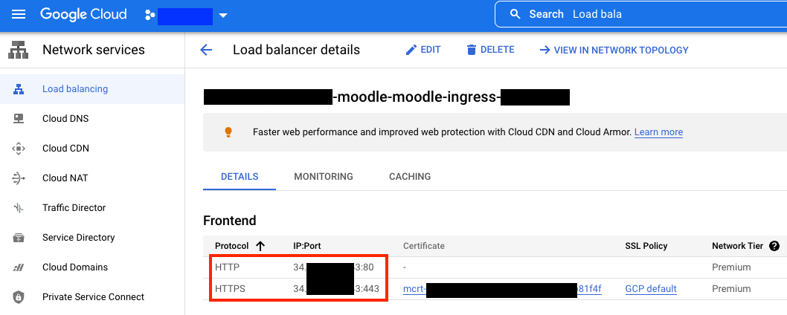
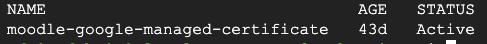

# Configuring SSL and forcing HTTPS redirect

> This document assumes that the working machine from where you pushing commands from has access to Google Kubernetes Engine (GKE) control plane.

This document highlights the steps needed to both create a new Google Cloud-managed certificate for Moodle's infrastructure and force HTTPS for every incoming request.

## Provisioning a new certificate managed by Google Cloud

The very first step is to replace values of a key variable in the `google-managed-ssl-certificate.yaml`, as follows.

1. Browse into directory `7-ssl-certificate-and-redirect`.
   
2. Edit the file `google-managed-ssl-certificate.yaml` with your preferred text editor.

3. Update the value of your domain name. Suggestively, we start with nip.io, a free option for public domain hosts. However, you can use whatever domain you eventually have here.

If you want to preserve the suggestive example, just replace the portion `<YOUR-LB-EXTERNAL-IP>` with the actual Load Balancer's public IP. That information can be gathered within the service blade in the Google Cloud console, as you can see below.

<p align="center">
    
</p>

```
spec:
  domains:
    # any domain name you have availabe to use:
    #- somedomain.somesite.com
    # ie.
    # www.mymoodlesite.com
    # or
    #- anything-you-want.<your-lb-external-ip-address>.nip.io
    # ie.
    - moodle.<YOUR-LB-EXTERNAL-IP>.nip.io
```
 
A real example of this replacement could be:

```
spec:
  domains:
    # any domain name you have availabe to use:
    #- somedomain.somesite.com
    # ie.
    # www.mymoodlesite.com
    # or
    #- anything-you-want.<your-lb-external-ip-address>.nip.io
    # ie.
    - moodle.12.12.121.12.nip.io
```

Save and close the document.

4. From the command line, execute the following command line to apply the changes in the cluster.

```
kubectl apply -f google-managed-ssl-certificate.yaml
```

Verify the updates were properly applied by running the command below.

```
kubectl get managedcertificate -n moodle
```

<p align="left">
    
</p>

## Forcing HTTPS for incoming requests

To force HTTPS over HTTP just apply the configurations set up in the file `frontendconfig-redirect-http-to-https.yaml` to the ingress. To do that, run the command line below.

```
kubectl apply -f frontendconfig-redirect-http-to-https.yaml
```

Verify the configuration was properly applied to the ingress by running the following.

```
kubectl get frontendconfig -n moodle
```